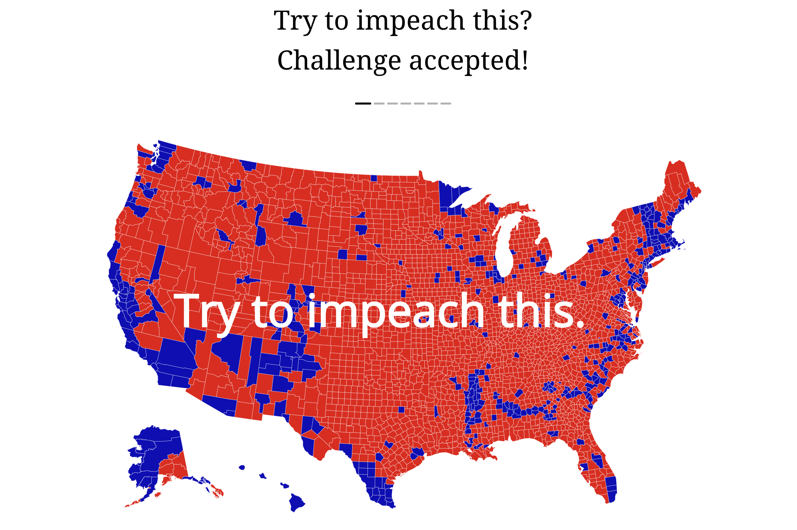

```{r setup, include=FALSE}
knitr::opts_chunk$set(echo = TRUE, warning = FALSE, message = FALSE, eval=FALSE)
library(tidyverse)
library(sf)
library(tigris) #download shp file from U.S. census website
library(tmaptools)
library(tmap)
library(ggmap)
```

# Intro: Choropleth Maps

- Choropleth maps display data on a map by shading regions with different colors. 

- In this lecture, we focus on packages `ggmap`, `ggplot2`, and `tmap` to create static maps. 

## Example 1

- Back when there was an effort to impeach Trump, 
Lara Trump tweeted a map of the US, which looked very red,
with the phrase "Try to Impeach This". 
A graphical designer, [Karim Douieb](https://www.linkedin.com/in/karim-douieb/), 
in Brussels (Belgium), 
who co-founded a company call [Jetpack.ai](https://www.jetpack.ai/), decided to weigh-in on this (American) political issue with an
interactive response web page title ["Try to impeach this? Challenge accepted!"](http://try-to-impeach-this.jetpack.ai). 

|

## Example 2

- Centers for Disease Control and Prevention provide a weekly influenza surveillance report using a choropleth map. 

- Check [Weekly US Map: Influenza Summary Update](https://www.cdc.gov/flu/weekly/usmap.htm)
